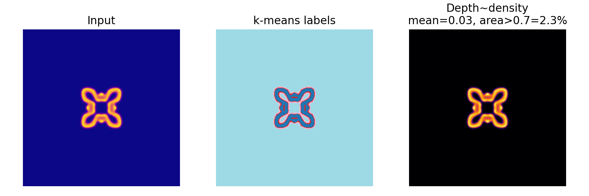
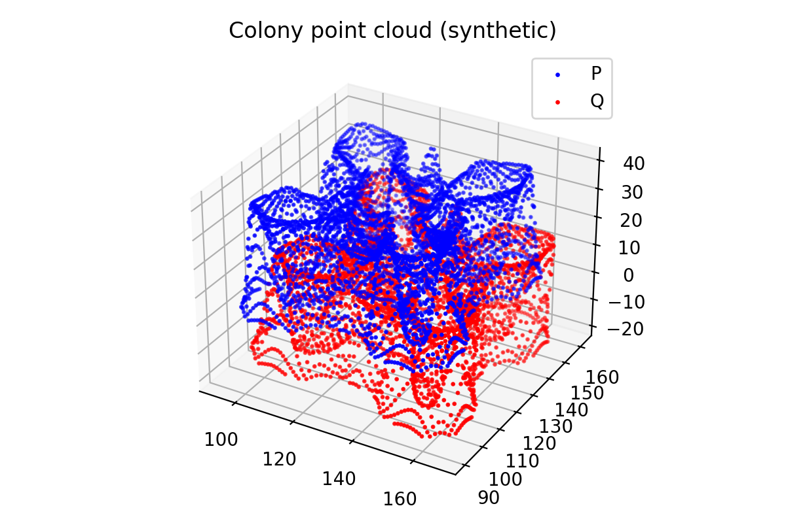
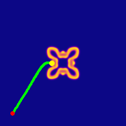
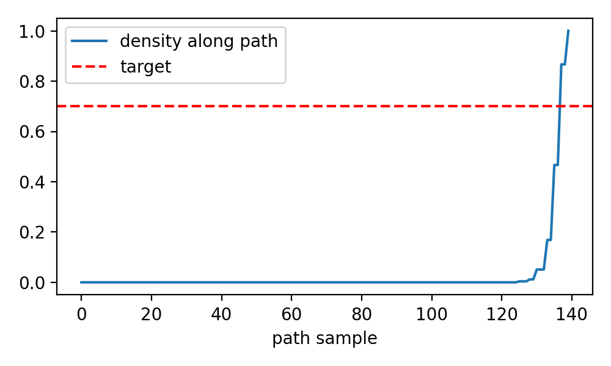

# ColonyVision

**ColonyVision** is a project based on simulating **microbial colony pattern formation** using a simple **reaction–diffusion model (Gray–Scott)**. It combines mathematical modeling with practical tools to demonstrate how biological patterns can be analyzed and acted upon using computational techniques.

The project uses **NumPy**, **Pillow**, and **Matplotlib** to implement:

- **Computer Vision**: Perform unsupervised segmentation (k-means) to identify and measure colony regions.
- **3D Geometry**: Convert synthetic depth maps into point clouds and apply **rigid alignment** using the **Kabsch algorithm**.
- **Trajectory Planning**: Generate smooth **Bezier curves** for planning a droplet’s path toward high-density colony areas.

This approach shows how core vision and geometry tasks can be achieved without relying on heavy libraries like OpenCV or PyTorch, while keeping the code transparent and mathematically grounded. The design is modular, making it easy to upgrade later with advanced libraries or real sensor data.

## Project Structure
ColonyVision/  
├─ src/  
│  ├─ simulate_colony.py     # Reaction–diffusion simulation & rendering  
│  ├─ vision_segment.py      # K‑means segmentation & density metrics  
│  ├─ pointcloud.py          # Depth → 3D point cloud + Kabsch alignment  
│  └─ controller.py          # Bezier droplet path planning & visualization  
├─ notebooks/  
│  └─ demo.ipynb             # One‑click pipeline demo  
├─ results/                  # Outputs (generated when you run)  
├─ README.md  
├─ requirements.txt  
└─ .gitignore  

## Quickstart

```bash
python -m venv .venv
source .venv/bin/activate
```
```bash
pip install -r requirements.txt
```
1) simulate colonies & render images
```bash
python src/simulate_colony.py --size 256 --steps 1200 --F 0.055 --k 0.062 --save results/col_256
```
2) segmentation & density metrics
```bash
python src/vision_segment.py --image results/col_256_image.png --out results/seg_256
```
3) point cloud from depth + rigid alignment
```bash
python src/pointcloud.py --depth results/col_256_depth.png --out results/pc_256
```
4) Bezier droplet path to target density
```bash
python src/controller.py --image results/col_256_image.png --target_density 0.7 --out results/ctrl_256
```

## 🧪 Scientific Background

### **1. Reaction–Diffusion (Gray–Scott Model)**
The Gray–Scott model explains how natural patterns like **spots and stripes** emerge through simple chemical interactions. Two substances diffuse and react, creating complex colony-like structures. By tuning parameters like feed rate (`F`) and kill rate (`k`), we can simulate different growth patterns.

**Example from our simulation:**  
  
*Figure: Simulated colony pattern using Gray–Scott reaction–diffusion.*

---

### **2. Colony Morphology Basics**
In microbiology, colonies grown on agar plates are described by:
- **Form:** Circular, irregular, filamentous  
- **Margin:** Smooth, wavy, lobate  
- **Elevation:** Flat, raised, convex  
- **Texture & Pigmentation:** Rough, shiny, colored  

Our simulation mimics these ideas by creating **density maps** similar to real colony growth.

**Example density map:**  
  
*Figure: Depth-like representation of colony density (brighter = denser).*

---

### **3. Vision Segmentation (K-Means)**
To analyze colonies, we use **k-means clustering**—a simple algorithm that groups pixels by color similarity. This helps separate dense colony regions from the background.

**Example segmentation result:**  
  
*Figure: Original image (left), segmented clusters (middle), density heatmap (right).*

---

### **4. Depth → 3D Point Cloud**
Depth maps can be converted into **3D point clouds** using the **pinhole camera model**, which maps image coordinates and depth values to real-world X, Y, Z positions. This is essential for robotics and vision systems to understand object geometry.

**Example point cloud visualization:**  
  
*Figure: Synthetic 3D point cloud of colony surface.*

---

### **5. Rigid Alignment (Kabsch Algorithm)**
The **Kabsch algorithm** finds the best rotation and translation to align two sets of points. This is useful for comparing colony shapes or registering multiple scans.

**Alignment report snippet:**  
```bash
Mean alignment error: 0.000
```

---

### **6. Bezier Trajectory Planning**
Bezier curves are smooth paths defined by control points. They are widely used in robotics for **safe and precise motion planning**. Here, we plan a droplet’s path to reach a high-density colony region without abrupt moves.

**Example trajectory overlay:**  
  
*Figure: Green dots = planned path, red = start, yellow = target.*

**Density along path:**  
  

*Figure: Density sampled along the trajectory compared to target threshold.*
